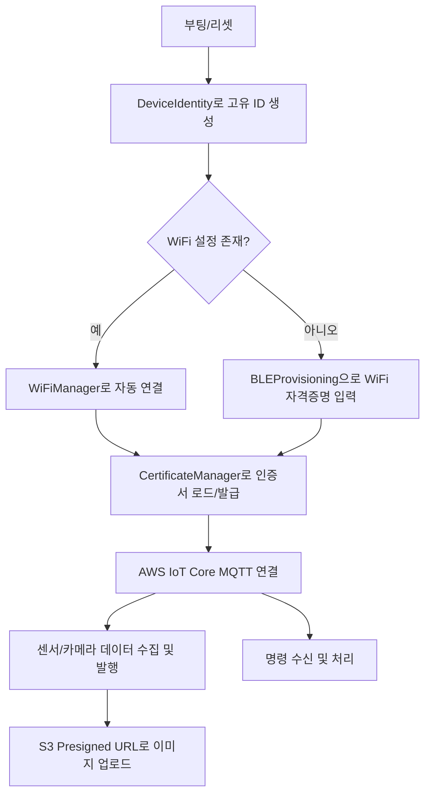

# Monoplex ESP32-S3 AWS IoT 프로젝트

## 1. 프로젝트 개요

이 프로젝트는 ESP32-S3 디바이스를 사용하여 AWS IoT Core와 안전하게 연동하고, MQTT 통신을 통해 데이터를 주고받는 기능을 구현합니다.

- **AWS IoT 연동**: 안전한 MQTT 통신을 위한 인증 및 연결
- **파일 시스템 활용**: LittleFS를 사용하여 설정 및 인증서 파일 관리
- **Fleet Provisioning**: 디바이스 자동 등록 및 인증서 발급
- **센서 데이터 처리**: 다양한 센서 데이터를 AWS IoT Core로 전송
- **명령 수신 및 이미지 업로드**: 원격 명령 수신 및 S3 이미지 업로드드

---

## 2. 프로젝트 구조

### 2.1. 폴더/파일 구조

```
.
├── src/                        # 주요 비즈니스 로직 및 하드웨어 제어
│   ├── main.cpp                # 엔트리포인트, 전체 시스템 오케스트레이션
│   ├── wifi_manager.cpp        # WiFi 연결/관리, 재연결, 설정 저장/복원
│   ├── ble_provisioning.cpp    # BLE 기반 WiFi 프로비저닝(초기 설정)
│   ├── certificate_manager.cpp # 인증서 관리, AWS IoT 연동 및 Fleet Provisioning
│   ├── camera_handler.cpp      # 카메라 초기화, 이미지 캡처/설정
│   ├── device_identity.cpp     # 디바이스 고유 ID 생성/관리
│   ├── ...                     # 기타 센서, 핀 설정, 헤더 등
├── include/                    # 공통 헤더 및 설정 파일
│   └── config.h                # 주요 상수, 환경설정, 경로, 토픽 등
├── lib/                        # 외부 라이브러리(필요시)
├── data/                       # 인증서, 설정 파일 등 LittleFS에 업로드
├── test/                       # 테스트 코드
├── platformio.ini              # PlatformIO 프로젝트 설정
├── partitions.csv              # 플래시 파티션 설정
├── README.md                   # 프로젝트 설명서
└── .gitignore, .vscode/        # 기타 설정/환경 파일
```

### 2.2. 주요 개념 및 비즈니스 로직

- **DeviceIdentity**: MAC 기반 고유 Device ID 생성, 모든 IoT/내부 식별에 사용
- **WiFiManager**: 저장된 SSID/PW로 자동 연결, BLE 프로비저닝, 자동 재연결, NVS 저장
- **BLEProvisioning**: BLE로 WiFi 자격증명 입력, BLE 특성 관리, 상태 피드백
- **CertificateManager**: 인증서(LittleFS) 관리, Fleet Provisioning, AWS IoT 연동
- **CameraHandler**: 카메라 초기화/캡처/최적화, PSRAM/DRAM 자동 감지
- **센서 연동**: 조도, IMU 등 센서 데이터 수집 및 MQTT 발행
- **MQTT 통신**: PubSubClient, 센서/이미지/명령 토픽별 통신, S3 Presigned URL 업로드

### 2.3. 파일시스템 이미지지

- **/data**: `claim.crt`, `claim.key`, `root_ca.pem` (임시: `device.crt`, `device.key`)
- **PlatformIO**: Build Filesystem Image, Upload Filesystem Image

### 2.4. 파티션 구성

`partitions.csv`
| 파티션명 | 타입 | 서브타입 | 시작 주소 | 크기 | 용량(MB) | 비율 |
|---------|------|---------|----------|------|---------|------|
| **nvs** | data | nvs | 0x9000 | 0x5000 | 0.02MB | 0.3% |
| **otadata** | data | ota | 0xe000 | 0x2000 | 0.008MB | 0.1% |
| **app0** | app | factory | 0x10000 | 0x400000 | 4MB | 50% |
| **spiffs** | data | spiffs | 0x410000 | 0x3F0000 | 3.94MB | 49.3% |
| **전체** | | | | **0x800000** | **8MB** | **100%** |

### 2.5. 비즈니스 로직 흐름



---

## 3. PlatformIO 설정

### 3.1. 기본 환경 설정

| 항목        | 값                   | 역할                       |
| ----------- | -------------------- | -------------------------- |
| `platform`  | `espressif32`        | ESP32 계열 MCU 개발 플랫폼 |
| `board`     | `esp32-s3-devkitc-1` | 하드웨어 보드 사양 정의    |
| `framework` | `arduino`            | 친숙한 Arduino 개발 환경   |

### 3.2. 메모리 시스템 설정

| 항목          | 값        | 성능 향상                     |
| ------------- | --------- | ----------------------------- |
| `memory_type` | `qio_opi` | 일반 SPI 대비 **4-8배 빠름**  |
| `flash_mode`  | `qio`     | 플래시 읽기 속도 **4배 향상** |
| `psram_type`  | `opi`     | PSRAM 접근 속도 **8배 향상**  |
| `flash_size`  | `8MB`     | 대용량 코드/데이터 저장       |

### 3.3. 빌드 플래그 분석

| 플래그                                | 값  | 목적                     |
| ------------------------------------- | --- | ------------------------ |
| `BOARD_HAS_PSRAM`                     | `1` | 라이브러리의 PSRAM 활용  |
| `CAMERA_MODEL_ESP32S3_EYE`            | `1` | 카메라 핀맵 자동 설정    |
| `CORE_DEBUG_LEVEL`                    | `1` | 적절한 디버그 정보 출력  |
| `ARDUINO_USB_CDC_ON_BOOT`             | `0` | 부팅 안정성 향상         |
| `CONFIG_SPIRAM_CACHE_WORKAROUND`      | `1` | PSRAM 하드웨어 버그 해결 |
| `CONFIG_CAMERA_CORE`                  | `0` | 카메라 전용 코어 할당    |
| `CONFIG_ESP32S3_DEFAULT_CPU_FREQ_240` | `1` | 최대 성능 모드           |

### 3.4. 라이브러리 의존성

| 라이브러리          | 버전   | 용도             | 크기       |
| ------------------- | ------ | ---------------- | ---------- |
| `PubSubClient`      | latest | MQTT 통신        | ~50KB      |
| `Adafruit VCNL4040` | ^1.2.0 | 근접/조도 센서   | ~20KB      |
| `SparkFun BMI270`   | ^1.0.3 | 6축 IMU 센서     | ~100KB     |
| `ArduinoJson`       | ^7.4.1 | JSON 데이터 처리 | ~200KB     |
| `esp32-camera`      | ^2.0.4 | 카메라 제어      | ~500KB     |
| **전체 예상 크기**  |        |                  | **~870KB** |

### 3.5. 통신 속도 설정

| 구분            | 속도        | 용도          | 예상 시간     |
| --------------- | ----------- | ------------- | ------------- |
| `monitor_speed` | 115,200 bps | 시리얼 디버그 | 실시간 로그   |
| `upload_speed`  | 921,600 bps | 코드 업로드   | 1MB → 약 10초 |

---

## 4. 주요 설정값 (config.h)

### 4.1. WiFi 및 BLE 설정

| 설정항목              | 값                                     | 설명                        |
| --------------------- | -------------------------------------- | --------------------------- |
| `WIFI_RSSI_THRES`     | `-75`                                  | WiFi 신호 강도 임계값 (dBm) |
| `SERVICE_UUID`        | `c20b0d0e-d8c2-4741-b26b-4e639bc40001` | BLE 서비스 UUID             |
| `DEVICE_ID_CHAR_UUID` | `c20b0d0e-d8c2-4741-b26b-4e639bc41001` | 디바이스 ID 특성 UUID       |
| `WIFI_PROV_CHAR_UUID` | `c20b0d0e-d8c2-4741-b26b-4e639bc41002` | WiFi 프로비저닝 특성 UUID   |
| `STATUS_CHAR_UUID`    | `c20b0d0e-d8c2-4741-b26b-4e639bc41003` | 상태 특성 UUID              |
| `WIFI_SCAN_CHAR_UUID` | `c20b0d0e-d8c2-4741-b26b-4e639bc41004` | WiFi 스캔 특성 UUID         |

### 4.2. AWS IoT Core 설정

| 설정항목                     | 값                                                   | 설명                        |
| ---------------------------- | ---------------------------------------------------- | --------------------------- |
| `AWS_IOT_ENDPOINT`           | `ac1scbno22vjk-ats.iot.ap-northeast-2.amazonaws.com` | AWS IoT Core 엔드포인트     |
| `PROVISIONING_TEMPLATE_NAME` | `MonoplexProvisioningTemplate`                       | Fleet Provisioning 템플릿명 |

### 4.3. 파일 시스템 경로

| 파일                | 경로           | 용도                               |
| ------------------- | -------------- | ---------------------------------- |
| **루트 CA 인증서**  | `/root_ca.pem` | AWS IoT Core 연결용 루트 인증서    |
| **클레임 인증서**   | `/claim.crt`   | Fleet Provisioning용 클레임 인증서 |
| **클레임 키**       | `/claim.key`   | Fleet Provisioning용 클레임 개인키 |
| **디바이스 인증서** | `/device.crt`  | 영구 디바이스 인증서               |
| **디바이스 키**     | `/device.key`  | 영구 디바이스 개인키               |

### 4.4. MQTT 토픽 구조

| 토픽 유형            | 토픽 패턴                                                                          | 설명                     |
| -------------------- | ---------------------------------------------------------------------------------- | ------------------------ |
| **인증서 생성**      | `$aws/certificates/create/json`                                                    | 새 인증서 요청           |
| **인증서 생성 성공** | `$aws/certificates/create/json/accepted`                                           | 인증서 생성 성공 응답    |
| **인증서 생성 실패** | `$aws/certificates/create/json/rejected`                                           | 인증서 생성 실패 응답    |
| **프로비저닝 요청**  | `$aws/provisioning-templates/MonoplexProvisioningTemplate/provision/json`          | 디바이스 프로비저닝 요청 |
| **프로비저닝 성공**  | `$aws/provisioning-templates/MonoplexProvisioningTemplate/provision/json/accepted` | 프로비저닝 성공 응답     |
| **프로비저닝 실패**  | `$aws/provisioning-templates/MonoplexProvisioningTemplate/provision/json/rejected` | 프로비저닝 실패 응답     |

### 4.5. 타이머 및 간격 설정

| 설정항목                     | 값      | 단위 | 설명                   |
| ---------------------------- | ------- | ---- | ---------------------- |
| `WIFI_RECONNECT_INTERVAL`    | `10000` | ms   | WiFi 재연결 시도 간격  |
| `MQTT_RECONNECT_INTERVAL`    | `5000`  | ms   | MQTT 재연결 시도 간격  |
| `MQTT_KEEP_ALIVE`            | `120`   | 초   | MQTT Keep-Alive 간격   |
| `MQTT_STATUS_CHECK_INTERVAL` | `60000` | ms   | MQTT 상태 체크 간격    |
| `CERT_RETRY_TIMEOUT`         | `120`   | 초   | 인증서 재시도 타임아웃 |

### 4.6. 버퍼 및 메모리 설정

| 설정항목             | 크기         | 용도                                         |
| -------------------- | ------------ | -------------------------------------------- |
| `JSON_BUFFER_SIZE`   | `128` bytes  | JSON 문서 처리용 버퍼                        |
| `MQTT_BUFFER_SIZE`   | `2048` bytes | MQTT 메시지 버퍼                             |
| `CERT_TOKEN_SIZE`    | `256` bytes  | 인증서 토큰 저장용                           |
| `DEVICE_ID_SIZE`     | `17` bytes   | 디바이스 ID 저장 (MLX\_ + 12자리 MAC + NULL) |
| `AWS_CLIENT_ID_SIZE` | `20` bytes   | AWS 클라이언트 ID 저장                       |

### 4.7. NTP 시간 동기화 설정

| 설정항목              | 값              | 설명                |
| --------------------- | --------------- | ------------------- |
| `NTP_SERVER`          | `pool.ntp.org`  | NTP 서버 주소       |
| `GMT_OFFSET_SEC`      | `32400` (9시간) | 한국 표준시 오프셋  |
| `DAYLIGHT_OFFSET_SEC` | `0`             | 일광절약시간 오프셋 |

### 4.8. 하드웨어 핀 설정

| 기능           | 핀 번호   | 설명                    |
| -------------- | --------- | ----------------------- |
| **LED 파란색** | `GPIO 2`  | MQTT 연결 상태 표시     |
| **LED 빨간색** | `GPIO 20` | 카메라 상태 표시        |
| **조명 제어**  | `GPIO 19` | 이미지 촬영시 조명      |
| **I2C SDA**    | `GPIO 41` | 센서 통신용 데이터 라인 |
| **I2C SCL**    | `GPIO 42` | 센서 통신용 클럭 라인   |

---

## 5. 시작하기

### 5.1. 사전 준비물

- **하드웨어**:
  - ESP32-S3 보드
- **소프트웨어**:
  - PlatformIO IDE (Cursor 확장)
- **AWS 서비스**:
  - AWS IoT Core (엔드포인트, 프로비저닝 템플릿, 정책 설정)

### 5.2. 환경 설정

1.  **상수 설정**:
    - `src/config.h`
      - `WIFI_SSID`: Wi-Fi 네트워크 SSID
      - `WIFI_PASSWORD`: Wi-Fi 네트워크 비밀번호
      - `AWS_IOT_ENDPOINT`: AWS IoT Core 엔드포인트 주소
      - (필요시) `PROVISIONING_TEMPLATE_NAME` 등 프로비저닝 관련 상수
2.  **인증서 준비**:
    - **현재**: `device.crt`, `device.key`, `root_ca.pem` 준비
    - **Fleet Provisioning 사용 시**: `claim.crt`, `claim.key`, `root_ca.pem` 준비
    - 준비된 인증서 파일들은 `data/` 폴더에 위치

### 5.3. 빌드 및 업로드

1.  **PlatformIO 초기화**:
    - PlatformIO가 프로젝트를 열 때 필요한 라이브러리를 자동으로 설치합니다.
2.  **(필요시) 파일 시스템 이미지 업로드**:
    - `data/` 폴더에 인증서나 설정 파일이 있다면, LittleFS 파일 시스템 이미지를 업로드합니다.
    ```bash
    pio run --target uploadfs
    ```
    - 이 작업은 펌웨어 업로드와 별개이며, `data/` 폴더 내용 변경 시 다시 실행해야 합니다.
3.  **펌웨어 빌드 및 업로드**:
    ```bash
    pio run --target upload
    ```
4.  **시리얼 모니터 실행**:
    ```bash
    pio device monitor
    ```
    - 부팅 로그, Wi-Fi 연결, MQTT 연결 상태 등을 확인합니다.

---

## 6. 주요 기능 및 사용법

### 6.1. AWS IoT 연결

- 부팅 시 Wi-Fi에 자동으로 연결하고, 설정된 인증서를 사용하여 AWS IoT Core에 MQTT 연결을 시도합니다.
- 연결 상태는 시리얼 모니터를 통해 확인할 수 있습니다.

### 6.2. 센서 데이터 발행

현재 구현된 센서 데이터 발행 토픽:

- **센서 데이터**: `devices/<DEVICE_ID>/sensors/data`
- **상태 정보**: `devices/<DEVICE_ID>/status`

#### JSON 데이터 형식 예시:

```json
{
  "proximity": 1024,
  "ambientLight": 25.3,
  "accelerometer": {
    "x": 0.15,
    "y": -0.03,
    "z": 9.81
  },
  "gyroscope": {
    "x": 0.01,
    "y": 0.02,
    "z": -0.01
  }
}
```

### 6.3. 이미지 캡처 및 업로드

#### 명령 수신:

- **토픽**: `devices/<DEVICE_ID>/image/capture`
- **페이로드 예시**:

```json
{
  "url": "https://bucket.s3.amazonaws.com/path/image.jpg?presigned-params"
}
```

#### 결과 발행:

- **토픽**: `devices/<DEVICE_ID>/image/done`
- **성공 시**:

```json
{
  "upload": 1
}
```

- **실패 시**:

```json
{
  "upload": 0,
  "error": "camera_capture_failed"
}
```

### 6.4. Fleet Provisioning

- 디바이스가 처음 부팅될 때 클레임 인증서를 사용하여 AWS IoT Core에 연결하고, 프로비저닝 템플릿을 통해 영구 인증서와 Thing을 자동으로 등록합니다.
- 프로비저닝 성공 후, 디바이스는 영구 인증서를 사용하여 AWS IoT Core에 연결합니다.
- **관련 설정**: `PROVISIONING_TEMPLATE_NAME`, 클레임 인증서, 관련 AWS IoT 정책 및 역할 설정이 필요합니다.

---

## 7. 문제 해결 및 디버깅

### 7.1. 일반적인 디버깅

- **시리얼 모니터 확인**: 대부분의 오류 정보는 시리얼 모니터에 출력됩니다. (연결 실패, 파일 로드 실패 등)
- **메모리 상태 확인**: `[MEM]` 태그로 힙/PSRAM 상태 모니터링

### 7.2. AWS IoT Core 관련

- **MQTT 테스트 클라이언트**: 메시지 송수신 확인
- **CloudWatch Logs**: AWS IoT 관련 로그 확인
- **인증서 및 정책**: 파일 유효성 및 권한 확인

### 7.3. MQTT 연결 상태 코드

| 코드 | 의미                 | 해결 방법            |
| ---- | -------------------- | -------------------- |
| `-4` | 서버 연결 타임아웃   | 네트워크/방화벽 확인 |
| `-3` | 네트워크 연결 끊어짐 | WiFi 신호 확인       |
| `-2` | 네트워크 연결 실패   | DNS/라우팅 문제      |
| `2`  | 클라이언트 ID 거부됨 | 중복 연결 확인       |
| `5`  | 권한 없음            | AWS IoT 정책 확인    |
