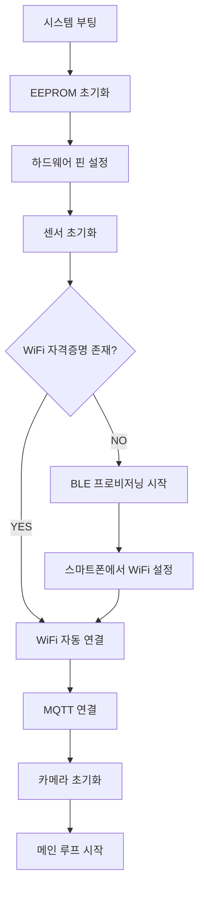
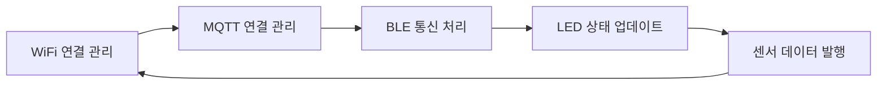

# MONOPLEX ESP32-S3 AI 센서 프로젝트

## 1. 프로젝트 개요

ESP32-S3 기반의 스마트 IoT 센서 장치로, BLE 프로비저닝을 통한 WiFi 설정, 다양한 센서 데이터 수집, 카메라 기능, MQTT 통신을 지원합니다.

### 주요 기능

- **BLE 프로비저닝**: 스마트폰을 통한 WiFi 설정
- **센서 데이터 수집**: 조도, 근접, 가속도, 자이로스코프 센서
- **카메라 시스템**: ESP32-S3-EYE 카메라 모듈 지원
- **MQTT 통신**: AWS IoT Core와의 데이터 송수신
- **EEPROM 설정 관리**: WiFi 자격증명 및 설정값 저장
- **LED 상태 표시**: WiFi/MQTT 연결 상태 시각적 피드백

---

## 2. 프로젝트 구조

### 2.1. 실제 파일 구조

```
MONOPLEX_ESP32_S3/
├── src/                        # 메인 소스 코드
│   ├── main.cpp                # 메인 애플리케이션 로직
│   ├── config.h                # 시스템 전역 설정
│   ├── config.cpp              # 인증서 및 설정 데이터
│   ├── globals.h               # 전역 변수 선언
│   ├── wifi_handler.cpp/.h     # WiFi 연결 및 관리
│   ├── ble_handler.cpp/.h      # BLE 프로비저닝 서비스
│   ├── mqtt_handler.cpp/.h     # MQTT 통신 관리
│   ├── camera_handler.cpp/.h   # 카메라 제어 및 이미지 처리
│   ├── sensor_handler.cpp/.h   # 센서 데이터 수집
│   ├── eeprom_handler.cpp/.h   # EEPROM 설정 관리
│   └── camera_pins.h           # 카메라 핀 정의
├── include/                    # 헤더 파일
├── lib/                        # 외부 라이브러리
├── data/                       # 파일시스템 데이터
├── platformio.ini              # PlatformIO 설정
├── partitions.csv              # 플래시 파티션 설정
└── README.md                   # 프로젝트 문서
```

### 2.2. 모듈별 주요 기능

#### **main.cpp**

- 시스템 초기화 및 메인 루프
- 모든 핸들러 모듈 조율
- LED 상태 관리
- 센서 데이터 주기적 발행

#### **wifi_handler**

- WiFi 연결 및 재연결 관리
- 연결 상태 모니터링
- WiFi 스캔 기능

#### **ble_handler**

- BLE 프로비저닝 서비스
- WiFi 자격증명 수신
- 디바이스 상태 브로드캐스팅

#### **mqtt_handler**

- MQTT 클라이언트 관리
- 메시지 발행/구독
- 자동 재연결

#### **camera_handler**

- 카메라 초기화 및 설정
- 이미지 캡처 및 압축
- 메모리 최적화

#### **sensor_handler**

- VCNL4040 (조도/근접) 센서
- BMI270 (6축 IMU) 센서
- JSON 형태 데이터 생성

#### **eeprom_handler**

- WiFi 자격증명 저장/로드
- 디바이스 설정 관리
- MAC 주소 기반 고유 ID

---

## 3. 하드웨어 설정

### 3.1. ESP32-S3 DevKit 핀 배치

| 기능           | 핀 번호 | 용도                     |
| -------------- | ------- | ------------------------ |
| **LED 파란색** | GPIO 2  | BLE 클라이언트 연결 상태 |
| **LED 빨간색** | GPIO 20 | WiFi 연결 상태           |
| **조명**       | GPIO 19 | 카메라 촬영용 보조 조명  |
| **I2C SDA**    | GPIO 41 | 센서 데이터 라인         |
| **I2C SCL**    | GPIO 42 | 센서 클럭 라인           |

### 3.2. 카메라 모듈 (ESP32-S3-EYE)

```cpp
// camera_pins.h에서 자동 정의
#define CAMERA_MODEL_ESP32S3_EYE
#define PWDN_GPIO_NUM     -1
#define RESET_GPIO_NUM    -1
#define XCLK_GPIO_NUM     15
#define SIOD_GPIO_NUM     4
#define SIOC_GPIO_NUM     5
// ... 기타 카메라 핀 설정
```

---

## 4. PlatformIO 설정

### 4.1. 플랫폼 설정 (platformio.ini)

```ini
[env:esp32-s3-devkitc-1]
platform = espressif32
board = esp32-s3-devkitc-1
framework = arduino

# 메모리 최적화 설정
board_build.arduino.memory_type = qio_opi
board_build.flash_mode = qio
board_build.psram_type = opi
board_upload.flash_size = 8MB
board_build.partitions = partitions.csv

# 성능 최적화 플래그
build_flags =
    -DBOARD_HAS_PSRAM
    -DCAMERA_MODEL_ESP32S3_EYE
    -DCONFIG_ESP32S3_DEFAULT_CPU_FREQ_240=1
    -DCONFIG_CAMERA_FB_IN_PSRAM=1
    -DCONFIG_SPIRAM_CACHE_WORKAROUND=1
```

### 4.2. 라이브러리 의존성

| 라이브러리          | 버전   | 용도             |
| ------------------- | ------ | ---------------- |
| `PubSubClient`      | latest | MQTT 통신        |
| `Adafruit VCNL4040` | ^1.2.0 | 조도/근접 센서   |
| `SparkFun BMI270`   | ^1.0.3 | 6축 IMU 센서     |
| `ArduinoJson`       | ^7.4.1 | JSON 데이터 처리 |
| `esp32-camera`      | ^2.0.4 | 카메라 제어      |

### 4.3. 파티션 구성

| 파티션      | 타입 | 크기   | 용도              |
| ----------- | ---- | ------ | ----------------- |
| **nvs**     | data | 20KB   | 설정 저장         |
| **otadata** | data | 8KB    | OTA 메타데이터    |
| **app0**    | app  | 4MB    | 메인 애플리케이션 |
| **spiffs**  | data | 3.94MB | 파일 시스템       |

---

## 5. 주요 설정값

### 5.1. WiFi 및 BLE 설정

```cpp
// config.h
#define WIFI_RSSI_THRES -75                                          // WiFi 신호 강도 임계값
#define SERVICE_UUID "c20b0d0e-d8c2-4741-b26b-4e639bc40001"         // BLE 서비스 UUID
#define DEVICE_ID_CHAR_UUID "c20b0d0e-d8c2-4741-b26b-4e639bc41001"  // 디바이스 ID 특성
#define WIFI_PROV_CHAR_UUID "c20b0d0e-d8c2-4741-b26b-4e639bc41002"  // WiFi 프로비저닝 특성
#define STATUS_CHAR_UUID "c20b0d0e-d8c2-4741-b26b-4e639bc41003"     // 상태 특성
#define WIFI_SCAN_CHAR_UUID "c20b0d0e-d8c2-4741-b26b-4e639bc41004"  // WiFi 스캔 특성
```

### 5.2. AWS IoT 설정

```cpp
const char AWS_IOT_ENDPOINT[] = "ac1scbno22vjk-ats.iot.ap-northeast-2.amazonaws.com";
const char PROVISIONING_TEMPLATE_NAME[] = "MonoplexProvisioningTemplate";
```

### 5.3. 타이머 설정

```cpp
const unsigned long WIFI_RECONNECT_INTERVAL = 10000;    // WiFi 재연결 간격 (10초)
const unsigned long MQTT_RECONNECT_INTERVAL = 5000;     // MQTT 재연결 간격 (5초)
const unsigned long MQTT_KEEP_ALIVE = 120;              // MQTT Keep-Alive (120초)
const unsigned long MQTT_STATUS_CHECK_INTERVAL = 60000; // MQTT 상태 확인 (60초)
```

---

## 6. 시스템 동작 흐름

### 6.1. 부팅 시퀀스



### 6.2. 메인 루프 동작



---

## 7. API 및 데이터 형식

### 7.1. 센서 데이터 JSON 형식

```json
{
  "deviceId": "MLX_AABBCCDDEEFF",
  "timestamp": 1641234567890,
  "proximity": 1024,
  "ambientLight": 25.3,
  "accelerometer": {
    "x": 0.15,
    "y": -0.03,
    "z": 9.81
  },
  "gyroscope": {
    "x": 0.01,
    "y": 0.02,
    "z": -0.01
  }
}
```

### 7.2. MQTT 토픽 구조

| 토픽 유형              | 토픽 패턴            | 방향      | 설명             |
| ---------------------- | -------------------- | --------- | ---------------- |
| **센서 데이터**        | `{deviceId}/sensor`  | Publish   | 센서 데이터 발행 |
| **이미지 캡처 명령**   | `{deviceId}/capture` | Subscribe | 이미지 촬영 명령 |
| **이미지 업로드 결과** | `{deviceId}/cdone`   | Publish   | 업로드 결과 응답 |

### 7.3. BLE 서비스 구조

```cpp
// BLE 프로비저닝 서비스
Service UUID: c20b0d0e-d8c2-4741-b26b-4e639bc40001

Characteristics:
├── Device ID (Read): c20b0d0e-d8c2-4741-b26b-4e639bc41001
├── WiFi Provisioning (Write): c20b0d0e-d8c2-4741-b26b-4e639bc41002
├── Status (Read): c20b0d0e-d8c2-4741-b26b-4e639bc41003
└── WiFi Scan (Read): c20b0d0e-d8c2-4741-b26b-4e639bc41004
```

---

## 8. 개발 가이드

### 8.1. 환경 설정

- PlatformIO

### 8.2. 설정 파일 수정

**config.h**에서 다음 값들을 환경에 맞게 수정:

```cpp
// AWS IoT 엔드포인트
const char AWS_IOT_ENDPOINT[] = "your-iot-endpoint.iot.region.amazonaws.com";

// BLE 디바이스 이름
#define BLE_DEVICE_NAME "YOUR_DEVICE_NAME"

// 센서 핀 설정 (필요시)
#define I2C_SDA_PIN 41
#define I2C_SCL_PIN 42
```

### 8.3. 디버깅 가이드

1. **시리얼 모니터 확인**

   - 115200 baud rate로 설정
   - WiFi/MQTT 연결 상태 확인
   - 센서 데이터 출력 확인

2. **LED 상태 해석**

   - 빨간색 LED: WiFi 연결 상태 (연결 시 깜빡임)
   - 파란색 LED: BLE 클라이언트 연결 상태 (연결 시 켜짐)

3. **메모리 사용량 모니터링**
   ```
   [MEM] Free DRAM heap: xxxxx bytes
   [MEM] Free PSRAM heap: xxxxx bytes
   ```

---

## 9. 문제 해결

### 9.1. 일반적인 문제

| 문제               | 원인                 | 해결방법                  |
| ------------------ | -------------------- | ------------------------- |
| WiFi 연결 실패     | 잘못된 자격증명      | BLE로 재설정              |
| 카메라 초기화 실패 | 메모리 부족/핀 충돌  | 재부팅 또는 하드웨어 확인 |
| MQTT 연결 실패     | 네트워크/인증서 문제 | 엔드포인트 및 인증서 확인 |
| 센서 데이터 없음   | I2C 연결 문제        | 핀 연결 및 센서 전원 확인 |

### 9.2. MQTT 상태 코드

| 코드 | 의미                 | 해결방법             |
| ---- | -------------------- | -------------------- |
| `-4` | 서버 연결 타임아웃   | 네트워크 연결 확인   |
| `-3` | 네트워크 연결 끊어짐 | WiFi 신호 강도 확인  |
| `-2` | 네트워크 연결 실패   | DNS/라우팅 문제 확인 |
| `2`  | 클라이언트 ID 거부됨 | 중복 연결 확인       |
| `5`  | 권한 없음            | AWS IoT 정책 확인    |

### 9.3. 성능 최적화

1. **메모리 최적화**

   - PSRAM 적극 활용
   - 카메라 버퍼 크기 조정
   - JSON 문서 크기 최소화

2. **전력 관리**

   - WiFi 절전 모드 활용
   - 센서 샘플링 주기 조정
   - 불필요한 기능 비활성화

3. **통신 최적화**
   - MQTT Keep-Alive 조정
   - 재연결 간격 조정
   - QoS 레벨 최적화
